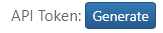
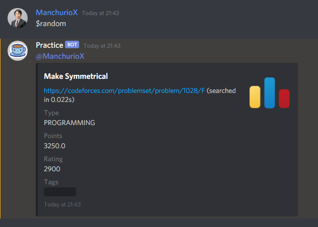
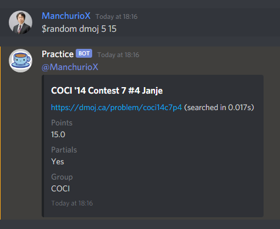
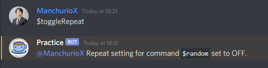
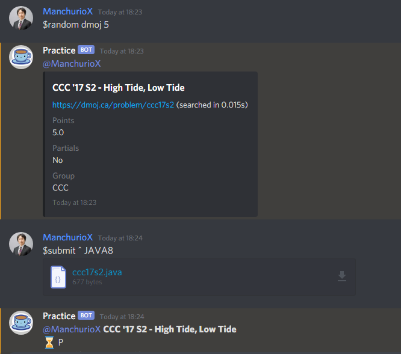

## Commands
### General
 - `$help` Sends you a list of my commands (obviously)
 - `$suggest <suggestion>` Sends me a suggestion
 - `$ping` Checks my ping to the Discord server
### Online Judge (DMOJ, Codeforces, AtCoder, WCIPEG integration)
 - `$login dmoj <token>` FOR DIRECT MESSAGING ONLY, logs you in using your DMOJ API token for problem submission
 - `$submit <problem-code> <language> <script>` Submits to a problem on DMOJ (requires login)
 - `$submit ^ <language> <script>` Submits to the last DMOJ problem you got using the `$random` command (requires login)
 - `$random` Gets a random problem from DMOJ, Codeforces, AtCoder, or WCIPEG
 - `$random <online judge>` Gets a random problem from a specific online judge (DMOJ, Codeforces, AtCoder, or WCIPEG)
 - `$random <online judge> <points>` Gets a random problem from a specific online judge (DMOJ, Codeforces, AtCoder, or WCIPEG) with a specific number of points
 - `$random <online judge> <minimum> <maximum>` Gets a random problem from a specific online judge (DMOJ, Codeforces, AtCoder, or WCIPEG) within a specific point range
 - `$toggleRepeat` Toggles whether or not you want problems that you have already solved when performing a `$random` command (requires at least 1 linked account)
 - `$profile <user>` See a user's linked accounts
 - `$profile` See your linked accounts
 - `$whois <name>` Searches for a user on 4 online judges (DMOJ, Codeforces, AtCoder, WCIPEG) and GitHub
 - `$notify` Lists contest notification channels in a server (requires admin)
 - `$notify <channel>` Sets a channel as a contest notification channel (requires admin)
 - `$unnotify <channel>` Sets a channel to be no longer a contest notification channel (requires admin)
 ### Programming
 - `$run <language> <stdin> <script>` Runs a script in one of 72 languages! (200 calls allowed daily for everyone)
 - `$whatis <query>` Searches for something on WCIPEG Wiki or Wikipedia
 ### Fun
 - `$motivation` Sends you some (emotional) support 😊
 - `$tea <user>` Sends a user a cup of tea (a pointless point system)
 - `$tea` Checks how many cups of tea you have
 - `$cat` Gets a random cat image

## Quick Start
Hello! Thank you for inviting Practice Bot to your server! To begin, let's link your Discord account to your DMOJ account.
 

Go to [https://dmoj.ca/edit/profile/](https://dmoj.ca/edit/profile/) and find the **API Token**. Hit Generate or Regenerate to get your token. This way, you can log in to Practice Bot and connect your DMOJ account to Discord. Do not share this token with anyone! 

For your security, Practice Bot will NOT save your token, and it may be lost when the bot's cache is reset. However, once you log in once, your Discord is linked to your DMOJ account, and you will only need to log in again to submit problems. Besides submitting to problems on DMOJ, logging in allows you to find problems that you haven't solved yet, automatically assigns you a role based on your DMOJ rating, and allows others to easily find your DMOJ account.

Using your API token, login to Practice Bot **through a direct message**. You can delete this message once you've logged in for your security.

Now, go back to the server and try out the random command. This will get you any problem from DMOJ, Codeforces, AtCoder, or WCIPEG!

Use parameters to filter for certain types of problems!

If you logged in, you can use the toggleRepeat command to get only problems that you have not completed (DMOJ only).

Try submitting to a problem (DMOJ only).

You can use `^` as the problem code to get the last (DMOJ) problem that you got using the random command.

If your code is too long to fit in a Discord message, upload the file directly instead!

That's all the basics to Practice Bot! Check out the commands for a list of everything you can do. Have fun practicing!
