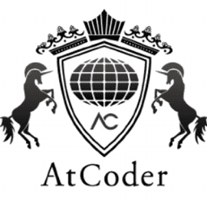

# Practice-Bot
The all-competitive-programming-purpose Discord bot!

Discord to DMOJ/Codeforces/AtCoder/WCIPEG integration. Handles problems, accounts, ratings, contests, and submitting. Everything for your competitive programming server needs!

[🍵 Invite me to your server!](https://discord.com/api/oauth2/authorize?client_id=691416325557452861&permissions=402779152&scope=bot)

<!-- [☕ Invite me to your server! (without automatic DMOJ-based ranked roles)](https://discordapp.com/api/oauth2/authorize?client_id=691416325557452861&permissions=34816&scope=bot)
> Note: Do not give Practice Bot the `Manage Roles` permission if you want to keep automatic DMOJ-based ranked roles off -->

---

[👀 Check me out on TOP.GG](https://top.gg/bot/691416325557452861)

[👀 Check me out on Bots For Discord](https://botsfordiscord.com/bot/691416325557452861)

[👀 Check me out on Discord Bot List](https://discordbotlist.com/bots/691416325557452861/)

## Commands
[Full list of commands here](COMMANDS.md)
  
## Tools
 - discord.py
 - [DMOJ API](https://dmoj.ca/api/)
 - [Codeforces API](https://codeforces.com/apiHelp)
 - [nomikura/atcoder-api](https://github.com/nomikura/atcoder-api)
 - [kenkoooo/AtCoderProblems](https://github.com/kenkoooo/AtCoderProb✔ems)
 - [WCIPEG](https://wcipeg.com/main)
 
  | | Random Problems | Random Contests | Rating Roles | Account Link | Submission |
  |---|---|---|---|---|---|
  | DMOJ | ✔ | ✔ | ✔ | ✔ | ✔ |
  | Codeforces | ✔ | ✔ | ❌ | ❌ | ❌ |
  | AtCoder | ✔ | ✔ | ❌ | ❌ | ❌ |
  | WCIPEG | ✔ | ❌ | ❌ | ❌ | ❌ |

  
 
  
 
  
 
 

 *Not affiliated with DMOJ, Codeforces, AtCoder, or WCIPEG. Sites are only used as tools for this bot.

## Icon
> 
